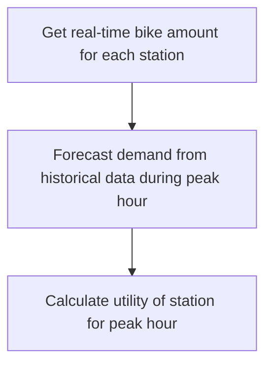
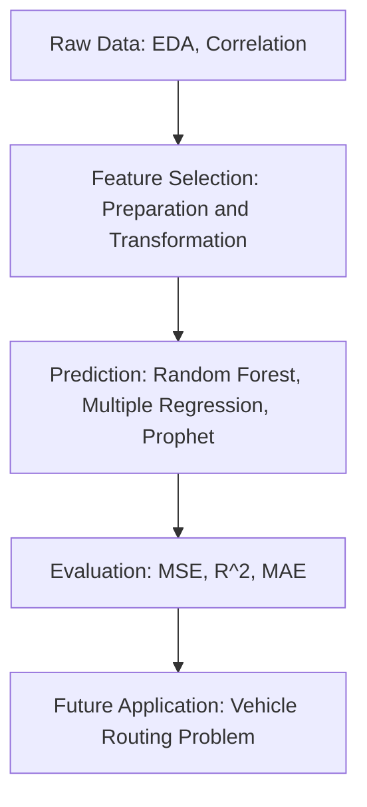

# MDS report: Optimizing Peak-hour YouBike Redistribution for Enhanced Efficiency
## Background and Motivation

### Background
- **Improved Transportation Efficiency**: By diagnosing and addressing the process-related issues in YouBike services, such as the inefficient replenishment of bikes during peak hours, the optimization process aims to enhance the overall efficiency of the transportation system. This, in turn, leads to more reliable and readily available transportation options for students and the community, reducing waiting times and enhancing the overall commuting experience.

- **Reduced Congestion and Environmental Impact** : Optimizing YouBike scheduling contributes to a reduction in congestion within the campuses and surrounding areas. As students have better access to bikes, it may lead to a decreased reliance on other modes of transportation, such as cars or scooters. This shift towards sustainable transportation helps alleviate traffic congestion and reduces the environmental impact associated with conventional vehicles, aligning with broader goals of promoting eco-friendly practices.

- ** Poor Experience**: The scheduling optimization ensures that YouBike users experience fewer instances of unavailability during peak hours. This improvement directly enhances the overall user experience, making biking a more attractive and reliable option for commuting. Positive user experiences can lead to increased adoption of YouBike services, promoting a culture of sustainable and shared transportation.

### Motivation
The purpose of this project is to address the frequent unavailability of YouBikes during peak hours at National Taiwan University (NTU) and National Taiwan University of Science and Technology (NTUST). Due to the substantial student population and the demand for post-class commuting, instances of insufficient bikes and delays in replenishing them by the scheduling personnel are common. Therefore, the primary objective is to predict user demand, offering optimized routes to enhance the efficiency of scheduling personnel in promptly replenishing bikes.

### Problem Definition
Due to the large number of students and their need to commute after class, there are not enough bicycles available. The objective is to forecast user demand and offer optimized routes, with the aim of improving the efficiency of scheduling staff to replenish bicycles quickly during these peak demand periods.

## Methodology
### Research Framework

### Method
### Data Collection
Data crawling refers to the process of extracting information from various sources on the internet, typically in a systematic and automated manner. In the context of the "YouBike2.0 Taipei City Public Bicycle Real-time Data" API with a timestamp of 2023.03.31 17:00, the focus is on gathering specific information related to selected stations.

In this particular dataset, 75 station numbers have been chosen for analysis. Each station is identified by a Station ID (sna), and additional details include the total number of docks (tot), the number of bikes currently available (sbi), and the rate of bike availability calculated as the ratio of available bikes to the total docks (sbi/tot). It's worth noting that there are no missing values in the dataset, ensuring a comprehensive and reliable set of information.

The data columns for this API extraction include station ID (sna), total docks (tot), available bikes (sbi), and the rate of bike availability (sbi/tot). These parameters provide a detailed snapshot of the bicycle-sharing system in Taipei City at the specified timestamp, offering insights into the distribution and availability of bikes across the selected 75 stations. Data crawling in this context involves retrieving and organizing this information for further analysis or visualization, enabling stakeholders to make informed decisions about the utilization and management of the public bicycle system in the city.

#### data transformation
Data transformation is a crucial step in preparing raw data for analysis and modeling. In the context of the "YouBike2.0 Taipei City Public Bicycle Historical Data" for the period of October 2022 to March 2023 (6 months), several transformations and enhancements are outlined:

1. **Time Period:**
   - The historical data covers a time span from October 2022 to March 2023, totaling 6 months.

2. **Time Representation:**
   - The timestamp format is exemplified by the example "2023/01/01 12:00:00".
   - The hour component (0-23) will be transformed into dummy variables. This involves creating binary columns for each hour, representing whether the observation occurred during that specific hour.

3. **Bike Supply (y):**
   - The target variable, representing the bike supply (y), can be computed as the difference between the number of bikes returned and rented during a specific time interval. This information helps gauge the net change in bike availability.

4. **Integration of Weather Data:**
   - Weather data can significantly impact bike-sharing patterns. Integration of weather-related features such as temperature, precipitation, and wind speed into the dataset can provide additional context for understanding bike usage patterns.

####  feature selection
Use the correlation matrix as a heatmap to examine the correlation coefficients between meteorological conditions, shared bicycle usage, and net demand. Adjusting correlation coefficient thresholds can choose variables with higher correlations to improve model performance. The thresholds are 0.1, 0.2, and 0.3 to account for negative associations of some variables by considering absolute values. 

when the threshold is set at 0.3, the heatmap indicates a correlation between meteorological variables such weather condition, humidity, rainfall, and hours of rain and the number of bikes at stations one and two hours ago. However, increasing the threshold to 0.4 diminishes the model's expected accuracy. The elimination of most meteorological parameters and the study of bicycle counts at stations one and two hours before suggest that these variables improve forecast accuracy.

##  Analysis  Result

### EDA
1. Comparing the supply conditions, the occurrence of bike shortages is more likely around National Taiwan University (NTU) during the rush hours associated with the beginning and end of classes. During these periods, there is a higher likelihood of bikes reaching full capacity,' especially when students finish their classes. It is common for students to quickly utilize available bikes, leading to a significant reduction in bike availability after class hours

2. Observing the usage patterns, we notice a peak in bike utilization around 5:00 pm. For this analysis, our intention is to utilize the usage data at 5:00 pm as a key factor in predicting bike supply. This specific time point has been identified as a crucial indicator of high demand, and incorporating it into our predictive model will allow us to better anticipate and manage bike availability during peak usage periods.  

3. On weekdays, the usage volume is higher compared to weekends or holidays, where there is a noticeable decrease in bike utilization. This trend suggests that the YouBike2.0 system experiences lower demand during holidays as opposed to regular weekdays.

#### NTU College of social Sciences Building(West) 

| Model |                         RMSE       | MAE	          | adR^2 |
| --------                     | --------    | --------       | -------- |
| Random Forest regression     | 13.97       | 7.72           |0.82 |
| Multiple Regression          | 14.9303     | 10.7390        |0.7850 |
| XGBOOST	                   | 14.6620     | 9.7549         |0.73260 |

 
### Interpretation

Model Comparison: MSE/MAE/R2 for Random Forest Regression

Initially, we compared different models based on metrics such as Mean Squared Error (MSE), Mean Absolute Error (MAE), and R-squared (R2). The results indicated that Random Forest Regression outperformed other models.
Selection of Random Forest Regression for Modeling

Following the comparison, we chose Random Forest Regression as our modeling approach due to its superior performance in terms of predictive accuracy.
Observation of Short-Term Data's Impact on Model Effectiveness

In the process, we observed that training the model with short-term data for the specific month yielded better results than using a six-month dataset. Consequently, we decided to streamline our approach by directly using early March data to predict bike supply at the end of March, bypassing the need for a more extended training period.

Given our knowledge of the predicted outcomes during peak hours, we then retrieve real-time data on the number of available bikes at the stations on the same day. We incorporate the predicted changes in the number of bikes into the real-time figures. If the result is a negative value, it allows us to infer the extent of unmet demand—indicating the number of individuals seeking to borrow bikes but unable to do so.

In addition to the issue of bike shortages, there is also the problem of stations reaching full capacity, where individuals may be unable to return bikes even if they wish to. To address this, we employ a similar methodology, combining real-time bike counts with predicted changes and subtracting the total number of docks at the station. The result represents the estimated number of YouBikes at a given station that individuals intend to return but cannot due to a lack of available docks.

## Conclusion

### Shortage of Bikes at Stations

1. **Expansion of Stations with Bike Shortages:**
   - Identify and prioritize stations experiencing bike shortages and consider adding more stations in those areas to alleviate the imbalance in bike distribution.

2. **Increased Staffing for Bike Replenishment:**
   - Allocate additional personnel during peak hours to replenish bikes more frequently at stations facing shortages. This ensures a more responsive approach to maintaining adequate bike supply.

3. **Implementation of Economic Incentives:**
   - Introduce a shared economy model during peak hours by designing a reward mechanism. Incentivize users to ride bikes to stations experiencing shortages by offering monetary rewards for each trip made to such stations (e.g., 10 Yuan per trip). This rewards program can motivate users to actively contribute to rebalancing bike distribution.

### Full Stations
1. **Regular Deployment of Workers:**
   - For stations consistently reaching full capacity during peak hours, establish a regular schedule for dispatching workers to assist with bike relocation. This proactive approach helps prevent stations from becoming consistently full.

These strategies aim to address the specific challenges of bike shortages and full stations, ensuring a more efficient and balanced YouBike2.0 system. By combining technological enhancements, increased human intervention, and user incentives, the goal is to optimize bike availability across different stations, especially during peak demand periods.

### future application
According to our field investigation, the campus of National Taiwan University (NTU) and its surrounding areas are serviced by three bike replenishment workers. Among them, two workers drive 3.5-ton trucks capable of carrying 24 bikes each, while one worker drives a 1.5-ton truck with a capacity of 12 bikes.

Assumptions:
- The drivers start their routes from Exit 3 of the Gongguan MRT Station.
- If the bike shortage is less than 30%, the driver will replenish bikes; if it exceeds 70%, the driver will pick up bikes.
- Each station is to maintain a 50% availability rate of bikes.
- It takes 30 seconds to replenish one bike (from unloading from the truck to placing it on the station).
- Large stations require the pickup of 25 bikes (considered as large stations).
- At 4:00 PM, the number of bikes is at 50%.
- Due to high demand in the Gongguan area, it is assumed that the trucks can carry 48 ubikes each.

### References
- [Google OR Tools](https://developers.google.com/optimization/install?hl=zh-tw)
- [OR Tools 解車輛路徑問題](https://developers.google.com/optimization/routing/vrptw?hl=zh-tw)
- [最佳化理論](https://medium.com/jimmy-wang/%E6%9C%80%E4%BD%B3%E5%8C%96%E7%90%86%E8%AB%96-optimization-theory-406d02c5a411)
- [啟發式演算法](https://www.baeldung.com/cs/greedy-vs-heuristic-algorithm)
- [Greedy Algorithm](https://medium.com/ivymobility-developers/algorithm-a168afcd3611)
- [Genetic Algorithm](https://ithelp.ithome.com.tw/articles/10211706?sc=pt)
- [Simulated Annealing](https://cloud.tencent.com/developer/article/1424760)
- [時間與空間複雜度](https://hackmd.io/@joe94113/time_complexity_and_space_complexity)
- [車輛路徑問題（VRP, Vehicle Routing Problem)](https://www.youtube.com/watch?v=OKMssWdC0I0)
- [旅行銷售員問題（TSP, Travelling Salesman Problem](https://www.youtube.com/watch?v=1pmBjIZ20pE)
- [容量限制的車輛路徑問題（CVRP, Capacitated Vehicle Routing Problem)](https://developers.google.com/optimization/routing/cvrp?hl=zh-tw)
- [時間窗限制的車輛路徑問值（VRPTW, Vehicle Routing Problem with Time Windows）](https://developers.google.com/optimization/routing/vrptw?hl=zh-tw)